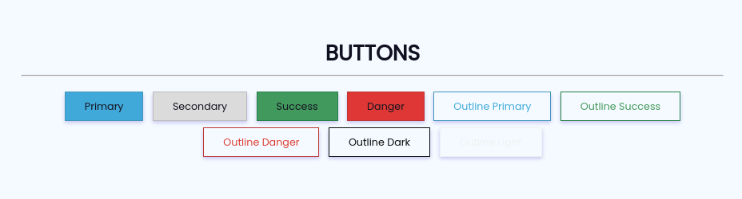
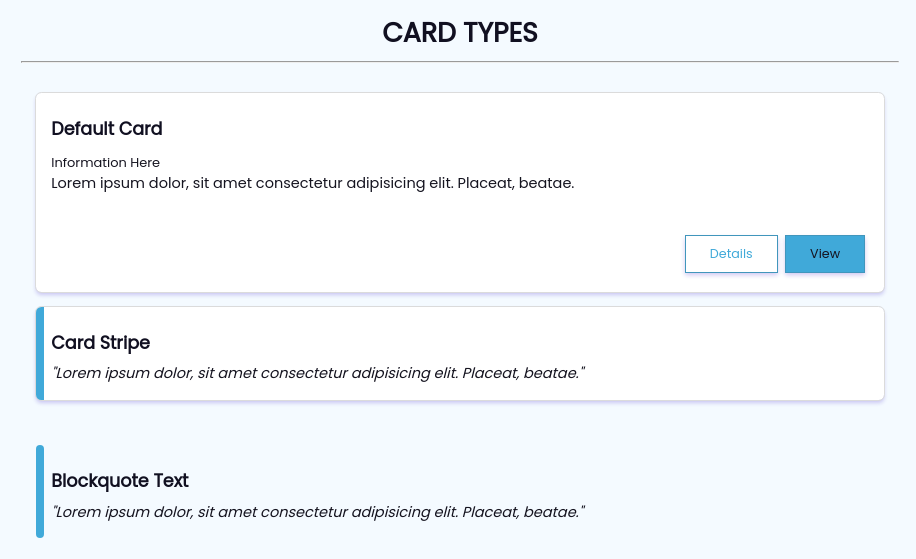
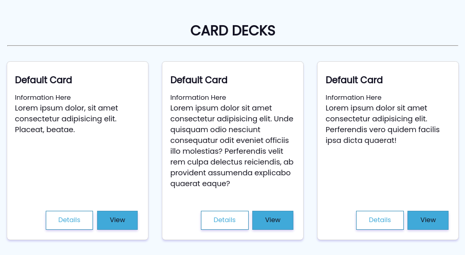
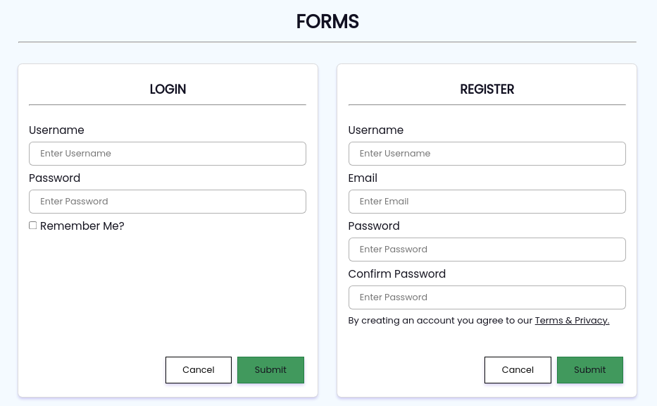
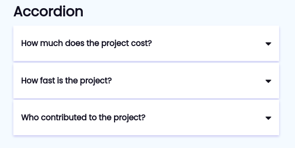

## Table of Contents
**Getting Started**
- [HTML Boilerplate](#html-boilerplate)

**Components**
- [Jumbotron](#jumbotron)
- [Button](#buttons-types)
- [Cards](#cards-types)
- [Card Layout](#card-layouts)
- [Accordion](#accordion)

### HTML Boilerplate
```
<!DOCTYPE html>
<html lang="en">
<head>
	<meta charset="UTF-8">
	<meta http-equiv="X-UA-Compatible" content="IE=edge">
	<meta name="viewport" content="width=device-width, initial-scale=1.0">
	<title>Document</title>
    <link rel="stylesheet" href="path/to/css/main.css" />
    <link rel="stylesheet" href="path/to/css/simple-grid.css" />

    <!--Defer if script needs to run after load-->
    <script defer src="path/to/js/script.js">
</head>
<body>
	<div class="container">
        ...
    </div>
</body>
</html>
```
### Jumbotron
```
<div class="jumbotron">
    <h1>Jumbotron</h1>
    <p>Lorem ipsum dolor, sit amet consectetur adipisicing elit. Debitis, assumenda!</p>
</div>
```
### Buttons Types

```
<button class="btn-primary">Primary</button>
```
```
<button class="btn-secondary">Secondary</button>
```
```
<button class="btn-success">Success</button>
```
```
<button class="btn-danger">Danger</button>
```
```
<button class="btn-outline-primary">Outline Primary</button>
```
```
<button class="btn-outline-success">Outline Success</button>
```
```
<button class="btn-outline-danger">Outline Danger</button>
```
```
<button class="btn-outline-dark">Outline Dark</button>
```
```
<button class="btn-outline-light">Outline Light</button>
```
### Cards Types

- Default Card
```
<div class="card">
    </img>
    <div class="card-body">
        <h5>Default Card</h5>
        <small>Information Here</small>
        <p>Lorem ipsum dolor, sit amet consectetur adipisicing elit. Placeat, beatae.</p>
    </div>
    <div class="card-footer">
        <button class="btn-outline-primary">Details</button>
        <button class="btn-primary">View</button>
    </div>
</div>
```
- Striped Card
```
<div class="card">
    <div class="stripe"></div>
    <div class="card-body">
        <h5>Card Stripe</h5>
        <blockquote>"Lorem ipsum dolor, sit amet consectetur adipisicing elit. Placeat, beatae."</blockquote>
    </div>
</div>
```
- Blockquote Text
```
<div class="blockquote">
    <div class="stripe"></div>
    <div class="blockquote-body">
        <h5>Blockquote Text</h5>
        <blockquote>"Lorem ipsum dolor, sit amet consectetur adipisicing elit. Placeat, beatae."</blockquote>
    </div>
</div>
```
### Card Layouts
**Card Deck** - a layout in which cards will have the same height and width inlined to one another.


**Card Masonry** - a layout similar to how pinterest layouts their photos. 

```
<!--On Works-->
```

### Forms

**Sample Login Form**
- Optional is to use simple-grid for adjusting the layout of the inputfields
```
<div class="card">
    <div class="card-body">
        <h5 class="text-center">LOGIN</h5>
        <hr>
        <br>
        <form class="login-form" action="">
            <label for="uname">Username</label>
            <input type="text" name="uname" placeholder="Enter Username">
            <label for="pass">Password</label>
            <input type="password" name="pass" placeholder="Enter Password">
            <label for="rememberme">
                <input type="checkbox" name="rememberme">
                Remember Me?
            </label>
        </form>
    </div>
    <div class="card-footer">
        <button class="btn-outline-dark">Cancel</button>
        <button class="btn-success">Submit</button>
    </div>
</div>
```
**Sample Register Form**
- Optional is to use simple-grid for adjusting the layout of the inputfields
```
<div class="card">
    <div class="card-body">
        <h5 class="text-center">REGISTER</h5>
        <hr>
        <br>
        <form class="login-form" action="">
            <label for="uname">Username</label>
            <input type="text" name="uname" placeholder="Enter Username">
            <label for="email">Email</label>
            <input type="email" name="email" placeholder="Enter Email">
            <label for="pass">Password</label>
            <input type="password" name="pass" placeholder="Enter Password">
            <label for="pass">Confirm Password</label>
            <input type="password" name="pass" placeholder="Enter Password">
            <small>By creating an account you agree to our <a href="#">Terms & Privacy.</a></small>
        </form>
    </div>
    <div class="card-footer">
        <button class="btn-outline-dark">Cancel</button>
        <button class="btn-success">Submit</button>
    </div>
</div>
```
### Accordion

```
<div class="accordion">
    <div class="accordion-card">
        <div class="accordion-card-header">
            <h6>How much does the project cost?</h6>
            <i class="fa fa-caret-down"></i>
        </div>
        <div class="accordion-card-body">
            <p>Lorem ipsum dolor sit amet consectetur adipisicing elit. Cupiditate esse et excepturi ad. Laudantium perspiciatis similique optio repudiandae iste sequi, ipsum assumenda possimus rerum sapiente recusandae, labore unde officia? Molestias.</p>
            <p>Lorem ipsum dolor sit amet consectetur adipisicing elit. Cupiditate esse et excepturi ad. Laudantium perspiciatis similique optio repudiandae iste sequi, ipsum assumenda possimus rerum sapiente recusandae, labore unde officia? Molestias.</p>
        </div>
    </div>
    <div class="accordion-card">
        <div class="accordion-card-header">
            <h6>How fast is the project?</h6>
            <i class="fa fa-caret-down"></i>
        </div>
        <div class="accordion-card-body">
            <p>Lorem ipsum dolor sit amet, consectetur adipisicing elit, sed do eiusmod tempor incididunt ut labore et dolore magna aliqua. Ut enim ad minim veniam, quis nostrud exercitation ullamco laboris nisi ut aliquip ex ea commodo consequat.</p>
        </div>
    </div>
    <div class="accordion-card">
        <div class="accordion-card-header">
            <h6>Who contributed to the project?</h6>
            <i class="fa fa-caret-down"></i>
        </div>
        <div class="accordion-card-body">
            <p>Lorem ipsum dolor sit amet, consectetur adipisicing elit, sed do eiusmod tempor incididunt ut labore et dolore magna aliqua. Ut enim ad minim veniam, quis nostrud exercitation ullamco laboris nisi ut aliquip ex ea commodo consequat.</p>
        </div>
    </div>
</div>
```